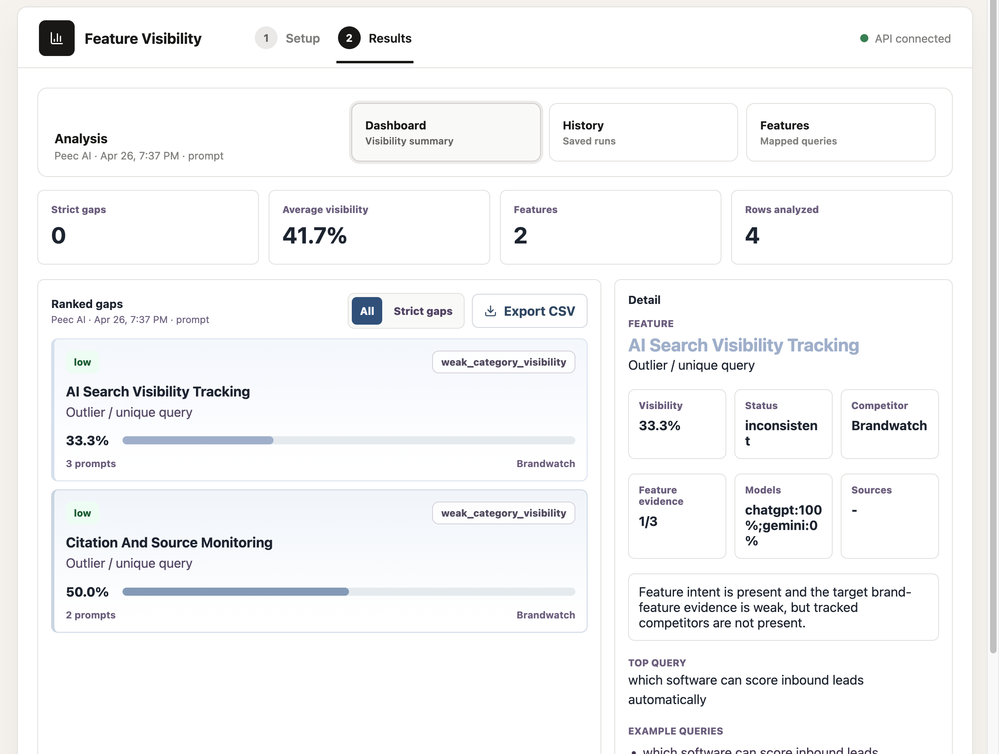
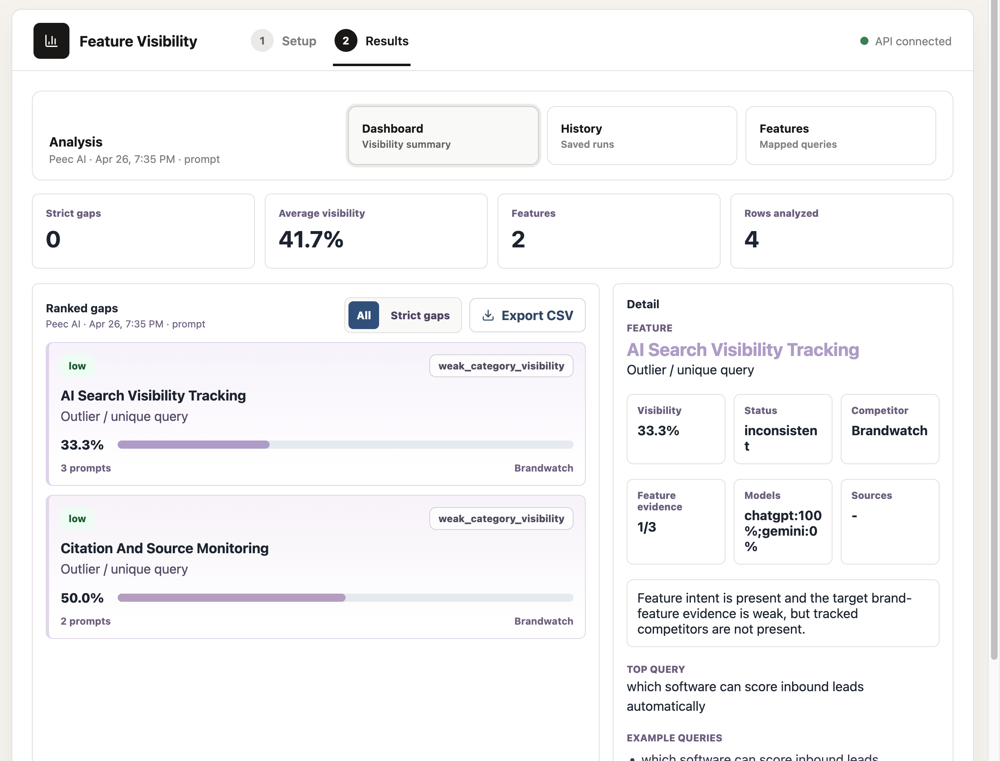
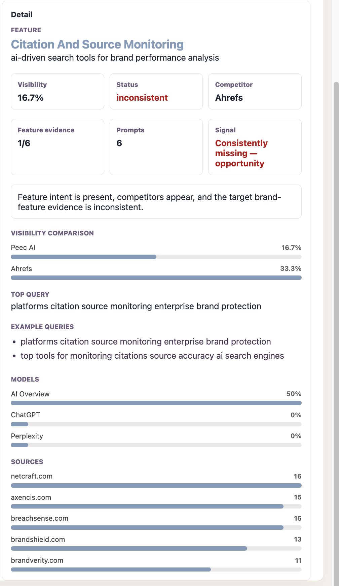
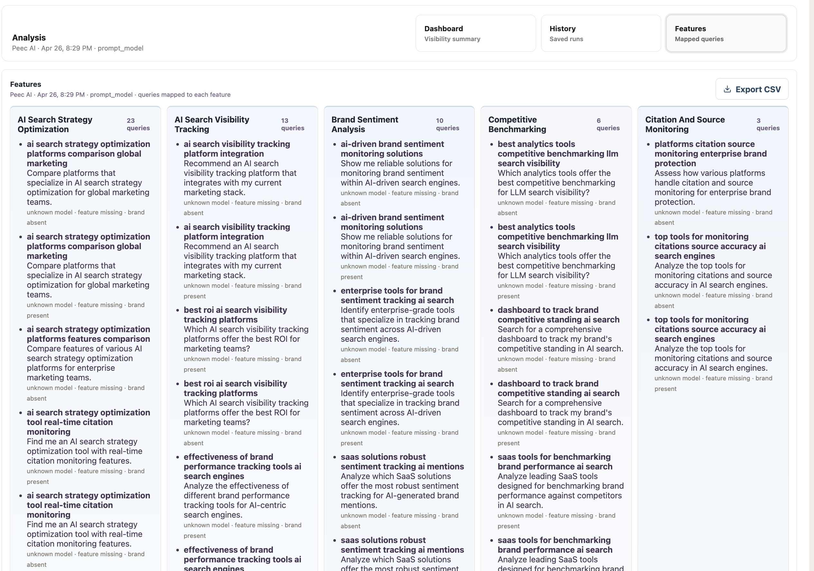

# Feature Visibility Gaps

Feature Visibility Gaps shows where a brand is missing from AI answers for product-feature demand.

It extends Peec by taking Peec prompt and response data and turning it into feature-level visibility diagnostics.

## What It Does

- pulls prompts and responses from Peec MCP, or accepts CSV fallback inputs
- maps demand to product features
- checks whether the target brand is visible for each feature demand area
- compares that visibility against competitors
- shows the strongest gaps in a demo-ready UI

## Inputs

The product works with three business inputs:

1. prompts and responses  
   Source: Peec MCP or prompts CSV

2. feature descriptions  
   Source: CSV or PDF upload

3. brands to track  
   Source: Peec-derived brands or brands CSV

## Output

The main output is a feature visibility dashboard with:

- visibility per feature cluster
- traffic-light status
- target vs competitor comparison
- example queries
- model and source breakdowns
- saved run history
- feature evidence view

## How It Extends Peec

Peec already helps collect prompts, responses, models, sources, and brand mentions.

This product extends that workflow by adding the feature analysis step:

- group demand by product feature
- measure whether the brand is visible for that feature demand
- surface the feature gaps that matter most

## Screenshots

### Dashboard



### Ranked Gaps



### Detail View



### Features View



## Run Locally

Backend:

```bash
python3 -m uvicorn src.api_server:app --host 127.0.0.1 --port 8787
```

Frontend:

```bash
cd web
npm install
npm run dev -- --host 127.0.0.1 --port 5173
```

Open:

```text
http://127.0.0.1:5173
```

## Modes

The UI supports:

- Peec MCP mode
- CSV fallback mode
- sample demo run
- CSV or PDF feature upload
- mock and real OpenAI-backed analysis modes

## Main Files

- `web/` - React demo UI
- `src/api_server.py` - local API
- `src/visibility_mvp.py` - feature visibility pipeline
- `src/peec_mcp_export.py` - Peec export layer
